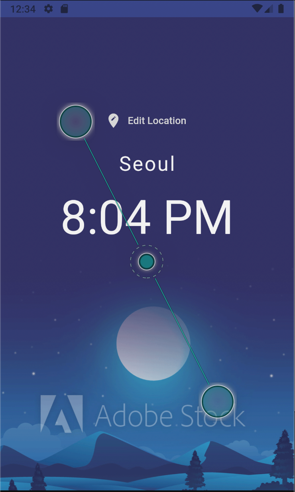
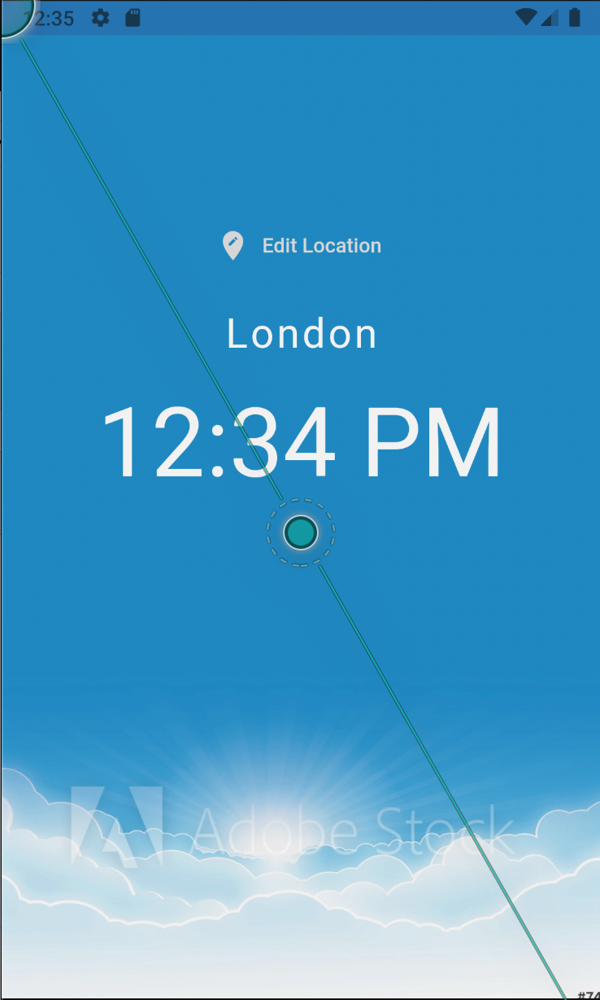
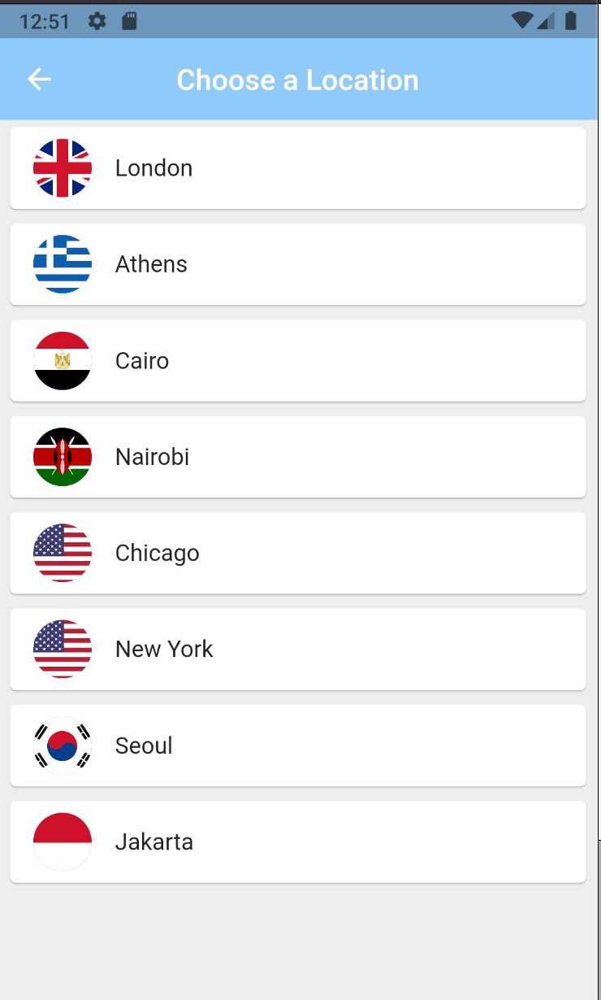

# world_time

The main of this application is to know the time of the city around the world by select the city you want in the list in choose location

## Screens
### night mode

### day mode

### list of city
